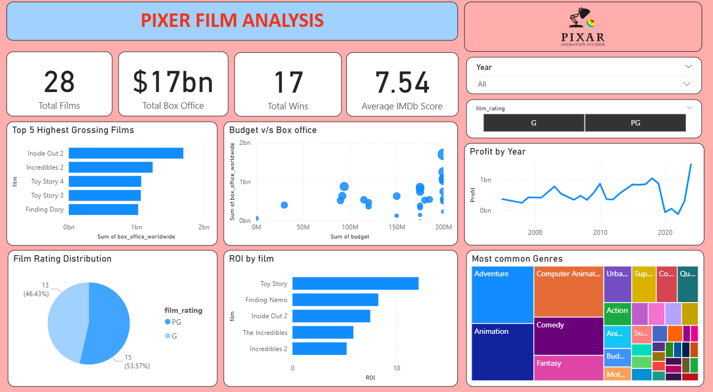

# Pixar_Film_Analysis

## Overview
This Power BI report provides an in-depth analysis of Pixar films, covering metrics such as box office performance, IMDb scores, film ratings, genres, awards, and production data.

## Key Insights
Total Films Analyzed: 28

Total Worldwide Box Office: $17 billion

Total Awards Won: 17

Average IMDb Score: 7.54

## Visualized Metrics
Top 5 Highest Grossing Films

Distribution of Film Ratings (G, PG)

Budget vs. Box Office Comparison

ROI by Film

Profit by Year

Most Common Genres

Awards Won vs. Nominated

Box Office Growth Over Time

Runtime Trends

IMDb Score Distribution

## Tools Used
Power BI Desktop
